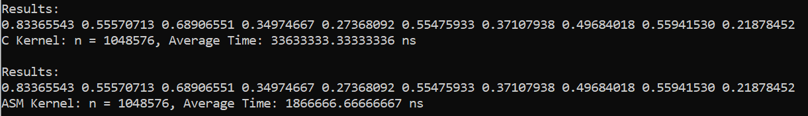

# x86toCMP2
To run the program type the following in cmd
nasm -f win64 MP2-asmfile.asm
gcc -c MP2-cfile.c -o cfile.obj -m64
gcc cfile.obj MP2-asmfile.obj -o cfile.exe -m64
Cfile.exe

i.) comparative execution time and short analysis of the performance of the kernels
We tested both C and Assembly on vector size 2^20, 2^24, 2^25, 2^26, 2^27. We only tested it up to 27 due to machine limitations. The rows images below are the outputs of both kernels and the time in ns that it took to perform the task. In the table below showing the output time of both C and ASM, we noticed that ASM is faster by 15 to 17 times compared to C.

|Vector Size | C Kernel average time | ASM Kernel average time | C time/ Asm time|
|------------|-----------------------|-------------------------|-----------------|
|2^20|34500000.00000000 ns|2233333.33333333 ns|15.44776119|
|2^24|566433333.33333349 ns|32933333.33333335 ns|17.19939271|
|2^25|1136899999.99999980 ns|71433333.33333331 ns|15.91553896|
|2^26|2301099999.99999950 ns|138733333.33333334 ns|16.58649688|
|2^27|4635699999.99999900 ns|276966666.66666663 ns|16.73739319|

